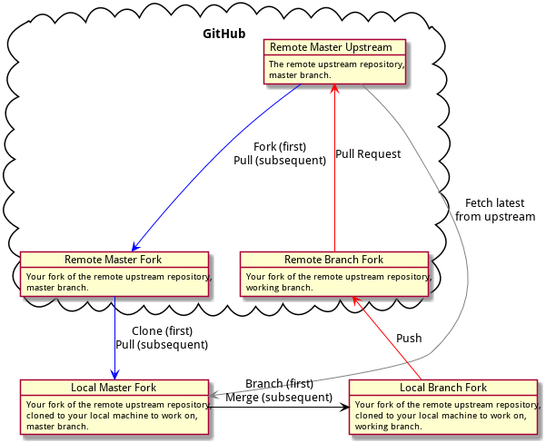

---

"Status": APPROVED
"Date Approved": 2019-05-27
"Obsoleted by": None
"Updated by": None
"Obsoletes": None
"Author(s)": Ryan Parman (@skyzyx)

---

# SPEP-2: One-Way Git Merges

## Copyright Notice

This document is made available under the terms of the [`LICENSE`](https://github.com/simplepie/rfc/blob/master/LICENSE) of this repository. The author wishes this document to be copyright-free and part of the public domain.

## Abstract

In order to reduce the probability of merge issues between branches during the development of features and fixes, this document is intended to prescribe a recommended approach to branch management.

This methodology has precedent in that it blends a method known as [git-flow] with the concept of the [fork and pull model], made popular by GitHub as [GitHub Flow]. The expectation is that the model propoposed by this document should feel familiar to anyone who is comfortable contributing to open-source projects.

## One-Way Git Merges

This is a diagram which shows how to submit changes to Git repos that you don't own and don't have write access to. This portion of the workflow is primarily derived from the [fork and pull model] of contributing that is used nearly everywhere in the open-source world.

**Fork → Branch → Edit → Commit → PR → Merge**

### Instructions

1. [Fork the repository](https://help.github.com/en/articles/fork-a-repo) into your own personal GitHub account.

1. [Clone your GitHub copy of the repository](https://help.github.com/en/articles/fork-a-repo#step-2-create-a-local-clone-of-your-fork) into your local workspace. This will make _your fork_ of the repository the remote `origin` by default.

1. [Add the original repository as the upstream repository](https://help.github.com/en/articles/fork-a-repo#step-3-configure-git-to-sync-your-fork-with-the-original-spoon-knife-repository) (so that you can pull down the latest changes). You can name it something like `upstream` or `up` for short.

1. [Create a new branch](https://help.github.com/en/articles/about-branches) (this is where [git-flow] comes in).

    * A branch for a new feature should be prefixed with `feature/` (e.g., `feature/my-awesome-feature`).
    * A branch for a release should be prefixed with `release/` (e.g., `release/1.2.1`).
    * A branch for a hotfix should be prefixed with `hotfix/` (e.g., `hotfix/memory-leak`).
    
1. Write code, fix bugs, and add tests with 100% code coverage.

1. Pull down changes from `origin/master` to your local `master`, then merge from your local `master` into your development branch. (Do not merge directly from `origin/master` to your development branch, or your local `master` will fall out of sync and mistakes become more likely.)

1. Commit your changes to your local workspace and push them up to your GitHub copy (e.g., the `origin` remote).

1. [Submit a GitHub pull request against the source repository](https://help.github.com/en/articles/creating-a-pull-request-from-a-fork) (i.e., `origin/master`) with a description of what the change is. You should assign the proper groups of people to review.

### PR Notes

1. [There should be multiple reviewers](https://help.github.com/en/articles/merging-a-pull-request) for your PR, if possible. Maybe there will be some banter back-and-forth in the comments. In the end, there should be multiple reviews marked as "approved".

1. The tests are run via continuous integration. [Passing tests are a prerequisite for merging the PR.](https://help.github.com/en/articles/about-branches)

1. If all goes well, your pull request will be accepted and [your changes are merged in](https://help.github.com/en/articles/merging-a-pull-request). “Squash merging” is used, which is the combination of all commits from the head branch (your branch) into a single commit in the base branch (master).

## INFORMATIVE

* [Leveraging SPEP-2 for Continuous Delivery](CONTINUOUS_DELIVERY.md)

  [fork and pull model]: https://help.github.com/en/articles/about-collaborative-development-models
  [git-flow]: https://github.com/nvie/gitflow
  [GitHub Flow]: https://guides.github.com/introduction/flow/
